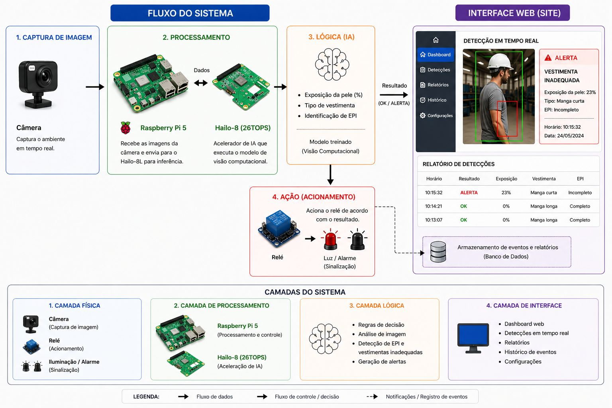
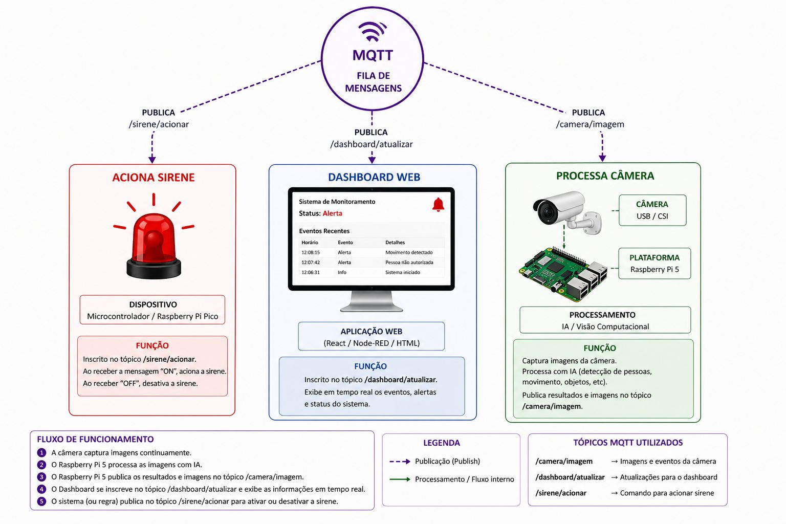

# 📄 PRD  —  Sistema de Reconhecimento Automatizado de Vestimenta com IA

---

##  1. Visão Geral

Este documento descreve os requisitos, arquitetura e especificações técnicas de um sistema inteligente para detecção automática de conformidade de vestimenta em ambientes laboratoriais.

A solução utiliza visão computacional embarcada e processamento em tempo real, sendo implantada no laboratório INOVFABLAB (UNISANTA).

###  Plataforma de Hardware

- Raspberry Pi 5  
- Hailo-8L (Acelerador de IA)  
- Módulo de câmera HBVCAM IMX586 (12MP, 4K @30fps)

---

##  2. Objetivo do Produto

Desenvolver um sistema embarcado capaz de:

- Identificar vestimentas inadequadas em tempo real  
- Reduzir a necessidade de supervisão manual  
- Aumentar a segurança em ambientes laboratoriais  
- Emitir alertas automáticos em situações de não conformidade  

---

##  3. Problema

A verificação manual de vestimentas apresenta limitações como:

- Inconsistência na fiscalização  
- Dependência de operadores humanos  
- Baixa escalabilidade  
- Risco de acidentes por falha humana  

---

##  4. Proposta de Solução

Implementação de um sistema autônomo baseado em IA que:

1. Captura imagens dos usuários  
2. Processa localmente (edge computing)  
3. Classifica vestimentas  
4. Gera alertas imediatos  

---

##  5. Stakeholders

- Usuários: Alunos  
- Operadores: Técnicos  
- Supervisores: Professores  
- Instituição: UNISANTA  

---

##  6. Escopo do Sistema

### ✔ Incluído

- Captura de vídeo em tempo real via câmera IMX586  
- Processamento embarcado no Raspberry Pi  
- Inferência com Hailo-8L  
- Classificação de vestimenta  
- Emissão de alertas  
- Comunicação de mensagens via protocolo MQTT
- Dashboard Web (React / Node-RED / HTML) para monitoramento em tempo real
- Acionamento de hardware externo (Relé / Sirene / Luz) via Microcontrolador (Raspberry Pi Pico)
- Armazenamento de eventos e relatórios em Banco de Dados

###  Excluído

- Reconhecimento facial  
- Armazenamento de imagens (salvamos apenas os eventos no Banco de Dados)
- Identificação de usuários  

---

##  7. Requisitos Funcionais

### RF-01 — Captura de imagem  
O sistema deve capturar frames contínuos via câmera IMX586.

### RF-02 — Detecção de presença  
O sistema deve detectar a presença de um indivíduo no campo de visão.

### RF-03 — Classificação  
O sistema deve classificar a vestimenta como:
- Adequada  
- Inadequada  

Adicionalmente, a lógica da IA deve realizar:
- Análise de exposição da pele (%)
- Identificação do tipo de vestimenta (ex: manga curta, manga longa)
- Identificação de EPI (completo / incompleto)

### RF-04 — Regras de validação  
O sistema deve identificar como inadequado:
- Uso de shorts  
- Uso de chinelos  
- Acessórios soltos  
- Cabelo não preso  

### RF-05 — Sistema de alerta  
O sistema deve emitir:
- Alerta visual  
- Alerta sonoro  

### RF-06 — Operação contínua  
O sistema deve operar automaticamente sem intervenção manual.

### RF-07 — Dashboard Web
O sistema deve prover uma interface web para exibir detecções em tempo real, relatórios, histórico de eventos e configurações.

### RF-08 — Comunicação MQTT
O sistema deve utilizar uma fila de mensagens MQTT para integrar a câmera, o processamento, o dashboard e os dispositivos de acionamento.

---

##  8. Requisitos Não Funcionais

### RNF-01 — Performance
- Mínimo de 10 FPS  

### RNF-02 — Latência
- Tempo de resposta inferior a 1 segundo  

### RNF-03 — Precisão
- Acurácia mínima de 85%  

### RNF-04 — Confiabilidade
- Operação contínua em ambiente de laboratório  

### RNF-05 — Eficiência
- Processamento otimizado para edge (Hailo-8L)  

### RNF-06 — Privacidade
- Não armazenamento de dados pessoais  
- Processamento local  

---

##  9. Arquitetura do Sistema

*Figura 1: Fluxo do Sistema e Camadas*

### 9.1 Camadas do Sistema

A arquitetura está dividida em 4 camadas principais:

1. **Camada Física**:
   - Câmera (Captura de imagem)
   - Relé (Acionamento via Raspberry Pi Pico / Microcontrolador)
   - Iluminação / Alarme (Sinalização sonora e visual)
2. **Camada de Processamento**:
   - Raspberry Pi 5 (Processamento e controle)
   - Hailo-8L (Aceleração de IA - 26TOPS)
3. **Camada Lógica (IA)**:
   - Regras de decisão e análise de imagem (Visão Computacional / YOLO)
   - Detecção de EPI e vestimentas inadequadas (Exposição da pele, tipo de vestimenta)
   - Geração de alertas
4. **Camada de Interface**:
   - Dashboard web (Detecções em tempo real, relatórios, histórico e configurações)
   - Banco de Dados (Armazenamento de eventos e relatórios)

### 9.2 Comunicação e Fluxos (MQTT)

*Figura 2: Fluxo de Funcionamento e Arquitetura MQTT*

O sistema utiliza o protocolo MQTT como fila de mensagens para a integração assíncrona dos componentes, através dos seguintes tópicos:

- `/camera/imagem`: A câmera captura imagens continuamente e o Raspberry Pi 5 (após o processamento da IA) publica os resultados da detecção e eventos neste tópico.
- `/dashboard/atualizar`: O Dashboard web se inscreve neste tópico para exibir informações em tempo real sobre eventos, alertas e status do sistema.
- `/sirene/acionar`: Tópico dedicado ao acionamento. O sistema ou regras de negócio publicam "ON" ou "OFF" neste tópico. O Microcontrolador (Raspberry Pi Pico), inscrito nele, recebe a mensagem e ativa/desativa a sirene e os relés da camada física.

---

---

##  10. Métricas de Validação

- Precisão do modelo  
- FPS médio  
- Tempo de inferência  
- Taxa de falsos positivos/negativos  

---

##  11. Stack Tecnológica

- Python   
- YOLO  
- SDK Hailo  
- Linux 
- Comunicação: MQTT
- Frontend/Dashboard: React / Node-RED / HTML
- Armazenamento: Banco de Dados
- Hardware de Acionamento: Raspberry Pi Pico (Relé)

---

## 🔗 12. Integração com Jira

### Épico
- Sistema de reconhecimento de vestimenta  

### Tasks
- Documentação  
- IA / Modelo  
- Integração  
- Testes  

### Subtasks
- PRD  
- Arquitetura  
- Implementação  
- Validação  

---

##  13. Roadmap

### Fase 1 — Planejamento
- Definição de requisitos  

### Fase 2 — Setup
- Configuração do hardware  

### Fase 3 — IA
- Dataset  
- Treinamento  

### Fase 4 — Integração
- Pipeline completo  

### Fase 5 — Testes
- Validação e ajustes  

---

##  14. Riscos

- Baixa iluminação  
- Dataset insuficiente  
- Oclusão  
- Limitações de hardware  

---

##  15. Critérios de Aceitação

- Sistema detecta vestimenta corretamente  
- Alertas funcionam corretamente  
- Desempenho mínimo atingido  
- Operação estável  

---

